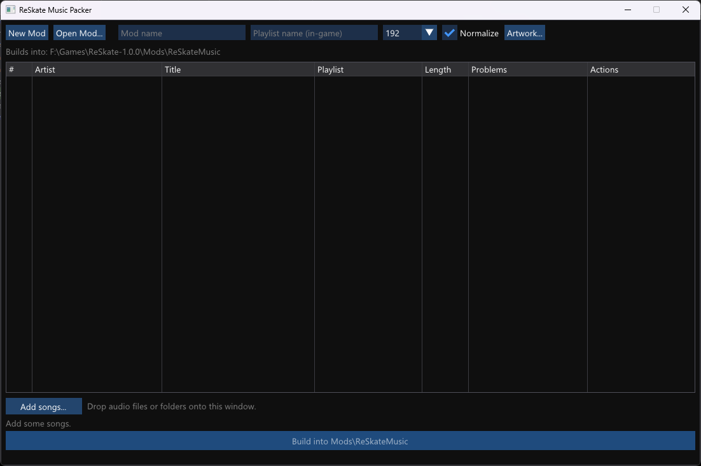

# ReSkate Music Packer

A standalone tool for Windows, macOS and Linux (GUI **and** CLI) that turns your audio files into add-only music mods for
**skate.** running on [ReSkate](https://github.com/Dingo-Shenanigans/ReSkate). It adds new songs and
custom playlists to the game's music without replacing any shipped files, so it survives game updates
and stacks with other mods.



- **Documentation:** [`docs/`](docs/index.md)
- **License:** [GPL-3.0](LICENSE) — includes engine code ported from [ReSkate](https://github.com/Dingo-Shenanigans/ReSkate) (see [NOTICE.md](NOTICE.md))

## Features

- **Hybrid GUI & CLI** - double-click for a Dear ImGui window (DirectX 12 on Windows, SDL2 on macOS
  and Linux), or script it from the command line for batch packing.
- **Add-only mods** - songs are added, never replacing the game's own tracks.
- **Custom playlists** - group songs into named playlists that appear in the in-game music menu.
- **Track & playlist artwork** - embedded album art is extracted automatically; pick your own image or
  generate a text cover, with a live preview. Covers are 512x512 PNGs saved with the mod.
- **Match the game's loudness** - EBU R128 two-pass `loudnorm` to **-15 LUFS** (true peak -1.5 dBTP),
  the level of the game's own tracks, so mod songs don't sound quiet next to them.
- **Encode cache** - transcoded Opus is cached by source hash, so rebuilding only re-encodes what
  changed.
- **Song clash warning** - checks artist/title against installed mods and the game's soundtrack so you
  don't collide with an existing song id.
- **Thunderstore export** - one click to a Thunderstore-ready `.zip` (`manifest.json`, generated
  README/tracklist, 256x256 icon).
- **One-click ffmpeg install (Windows)** - if ffmpeg/ffprobe are missing, download a pinned static LGPL build
  (BtbN/FFmpeg-Builds) into `.\ffmpeg` beside the app or `%LOCALAPPDATA%\ReSkateMusicPacker\ffmpeg`,
  verified against a SHA-256 before it is used.
- **High-DPI aware** - per-monitor v2 DPI scaling on Windows, Retina on macOS, the desktop scale on Linux.
- **Cross-platform** - on macOS and Linux the game's Oodle-compressed data is read with the
  open-source [ooz](https://github.com/zao/ooz) decoder, so no Windows DLL is needed; there the
  mod's archive is written uncompressed (a little larger, read the same way by the game).

## Requirements

- Windows 10/11 (x64), macOS 11+ (Apple Silicon or Intel), or a 64-bit Linux desktop (x86-64 or
  ARM64). On macOS and Linux the game itself runs under Proton/Wine/CrossOver; point the packer at
  that install folder.
- **[ffmpeg](https://ffmpeg.org/) and ffprobe** on your `PATH`, or in a folder you point the GUI at. They do the decoding,
  Opus encoding, album-art extraction, and loudness measurement. If they're missing, the GUI's
  **Download ffmpeg automatically** button fetches a pinned static LGPL build for you (only when you
  click it). ffmpeg is only needed to *build* mods, not to play them in game.
- **No installer and no Visual C++ redistributable** on Windows: the executable is self-contained
  (statically linked) and uses only Windows system libraries. On macOS and Linux it needs SDL2
  (`brew install sdl2 ffmpeg`, `sudo apt install libsdl2-2.0-0 ffmpeg`).
- A **ReSkate runtime that reads `reskate-music.json`** (mod playlists). Cover art additionally needs
  the runtime's mod-artwork support.

## Quick start (GUI)

1. Run `ReSkateMusicPacker.exe` with no arguments (or double-click it).
2. Set your **game folder** (the one containing `Skate.exe`) and, if ffmpeg isn't on `PATH`, its
   folder.
3. Drop songs or a folder onto the window (or use **Add songs...**), then set the mod name and
   playlist.
4. Optionally open **Artwork...** to override track art or generate a playlist cover.
5. **Build**. The mod folder is written next to your songs (or to the output folder you choose). Copy
   it into `F:\...\Mods\` (your ReSkate `Mods` folder) and enable it in the launcher.

## Quick start (CLI)

```powershell
ReSkateMusicPacker.exe "<game folder>" "<song folder>" [output folder] `
    --name "My Mix" --playlist "My Mix" `
    --playlist-artwork "My Mix" "cover.png" `
    --track-artwork "Artist - Title" "track.png"
```

See the [CLI reference](docs/cli.md) for every option.

## Supported audio

Anything ffmpeg can decode. The GUI file picker and the drop handler list
`.mp3 .flac .ogg .opus .wav .m4a .aac .wma .aiff .aif .webm .mka .mp4`; the CLI scans a folder for
non-image files and lets ffmpeg decide. Audio is encoded to stereo 48 kHz Opus (default 192 kbps,
64-320).

## What it produces

A ReSkate mod folder containing the add-only content (a TOC + `.cas` with the new `_mg`/`_nwa` assets
and audio chunks), a `reskate-music.json` describing your playlists and covers, the artwork PNGs, and
the project/build files so the mod can be reopened and rebuilt. See
[The mod format](docs/mod-format.md).

## Documentation

| Guide | Contents |
|---|---|
| [Getting started](docs/getting-started.md) | Install, GUI walkthrough, getting it into the game |
| [CLI reference](docs/cli.md) | Every flag, with examples and batch use |
| [The mod format](docs/mod-format.md) | What's in a mod, `reskate-music.json`, artwork, ReSkate requirements |
| [Building from source](docs/building.md) | Prerequisites and CMake |
| [Troubleshooting](docs/troubleshooting.md) | ffmpeg, clash warnings, missing covers, loudness, Thunderstore |

## Building

Windows: Visual Studio 2022 (v143) and CMake 3.20+. macOS/Linux: a C++20 compiler, CMake 3.20+
and SDL2. See [docs/building.md](docs/building.md).

## License

Copyright © 2026 DeckardDetribine and the ReSkateMusicPacker contributors. ReSkateMusicPacker is
free software, distributed under the [GNU General Public License, version 3](LICENSE) (GPL-3.0);
if you share a modified version, share its source code under the same license.

It includes engine code ported from the [ReSkate](https://github.com/Dingo-Shenanigans/ReSkate)
project (Copyright © 2026 the ReSkate contributors, also GPL-3.0), which is why this project is
GPL-3.0 rather than a permissive license. See [NOTICE.md](NOTICE.md) for provenance and for the
libraries under `External/`, which keep their own licenses.
